<h1 align="center">Лабораторна робота №7</h1>
<h3 align="center">Decode the QR-Code<br>QR-код версії 1: декодування, код Ріда — Соломона та межі його захисту</h3>

<p align="center">
  <a href="https://github.com/RE22GDV/LR7-QRCode/actions/workflows/ci.yml"></a>
  
  
  
  
  
</p>

> Дисципліна: Захист даних · Тема: двовимірні коди, завадостійке кодування, код Ріда — Соломона
> Задача: [Codewars — Decode the QR-Code](https://www.codewars.com/kata/5ef9c85dc41b4e000f9a645f), 6 kyu, C# (основна мова) і Python

Рівень корекції H виправляє 8 із 26 кодових слів, але не відрізняє пошкодження від підробки.

---

## Зміст

1. [Мета та постановка задачі](#1-мета-та-постановка-задачі)
2. [Математична модель](#2-математична-модель)
3. [Розв’язок](#3-розвязок)
4. [Структура репозиторію](#4-структура-репозиторію)
5. [Швидкий старт](#5-швидкий-старт)
6. [Верифікація](#6-верифікація)
7. [Обчислювальні експерименти](#7-обчислювальні-експерименти)
8. [QR-код і захист даних](#8-qr-код-і-захист-даних)
9. [Висновки](#9-висновки)
10. [Відтворення результатів](#10-відтворення-результатів)
11. [Список використаних джерел](#11-список-використаних-джерел)

---

## 1. Мета та постановка задачі

Мета роботи — прочитати повідомлення з QR-коду версії 1, поданого як
матриця 21 × 21, і з’ясувати, що саме забезпечує стійкість QR-коду до
пошкоджень. Найменший QR-код (версія 1) має 21 × 21 модуль, найбільший
(версія 40) — 177 × 177. Такі коди зберігають довільний текст: посилання,
номер замовлення, дані для входу в застосунок на Smart-TV тощо.

За умовою kata код завжди має версію 1, маску 0, байтовий режим і рівень
корекції H; позиція символу правильна. Потрібно пройти модулі зигзагом
від правого нижнього кута, пропускаючи службові зони, зняти маску й
розібрати біти: 4 біти режиму, 8 бітів довжини, далі байти тексту.
Корекцію помилок kata свідомо не розглядає.

| Величина | Значення |
|---|---|
| Вхід | `int[][]` 21 × 21: `1` — темний модуль, `0` — світлий |
| Вихід | рядок повідомлення |
| Маска | 0: інвертувати модуль, якщо `(i + j) mod 2 = 0` |
| Приклад з умови | 76 бітів `0100 00000010 01001000 01101001 …` → `Hi` |
| Приклад викладача | `Warrior`: режим `0100`, довжина `00000111`, байти `0x57 0x61 0x72 0x72 0x69 0x6F 0x72` |

Поглиблена частина виходить за межі kata. Реалізовано повний декодер
версії 1: читання службової інформації про формат, усі вісім масок,
числовий, буквено-цифровий і байтовий режими, виправлення помилок і
стирань кодом Ріда — Соломона. Кодер створює символи всіх рівнів і
обирає маску за штрафними правилами стандарту. Обидві реалізації
незалежно звірено з OpenCV та бібліотекою `reedsolo`. Досліджено
випадкові пошкодження, плями й логотип, маски та навмисну підміну.

---

## 2. Математична модель

### Будова символу

Із 441 модуля версії 1 лише 208 несуть дані: це 26 кодових слів по 8
бітів. Решта — три шукові візерунки з роздільниками (192 модулі),
смуги синхронізації (10), дві копії службової інформації про формат
(2 × 15) і темний модуль. Вирівнювальних візерунків версія 1 не має.

| Рівень | Інформаційні слова | Перевірні слова | t | p | Цифри | Букв.-цифр. | Байти |
|---|---:|---:|---:|---:|---:|---:|---:|
| L | 19 | 7 | 2 | 3 | 41 | 25 | 17 |
| M | 16 | 10 | 4 | 2 | 34 | 20 | 14 |
| Q | 13 | 13 | 6 | 1 | 27 | 16 | 11 |
| H | 9 | 17 | 8 | 1 | 17 | 10 | 7 |

Тут `t` — гарантована кількість виправних кодових слів, `p` — перевірні
слова, залишені для захисту від хибного декодування. Місткість у
символах обчислено з бітового бюджету; вона збігається з таблицями
стандарту ISO/IEC 18004.

### Маска

Маска запобігає довгим однотонним ділянкам, які заважають сканеру.
Біт даних отримують зі значення модуля `mᵢⱼ` за [формулою (1)](#formula-1):

<a id="formula-1"></a>

$$
b_{ij} = m_{ij} \oplus \left[(i + j) \bmod 2 = 0\right] \qquad\text{(1)}
$$

де `i` — номер рядка, `j` — номер стовпця, а квадратні дужки (дужка
Айверсона) дорівнюють одиниці, коли умова істинна, і нулю в іншому разі.
Маска 0 симетрична, тож неважливо, яку координату вважати `x`.

### Бітовий бюджет

Байтовий сегмент містить 4 біти режиму, 8 бітів довжини та по 8 бітів
на символ. Для `K` інформаційних слів найбільшу довжину повідомлення
визначає [формула (2)](#formula-2):

<a id="formula-2"></a>

$$
4 + 8 + 8L \le 8K \quad\Rightarrow\quad L_{\max} = \left\lfloor \frac{8K - 12}{8} \right\rfloor \qquad\text{(2)}
$$

Для рівня H (`K = 9`) виходить `L_max = 7` — рівно довжина `Warrior`.
Умова kata обґрунтовує 76 бітів як `4 + 8 + 8 · 8`, тобто до восьми
символів. Фактично інформаційних бітів лише 72: за довшого повідомлення
місця не вистачає, а біти 72–75 уже належать першому байту корекції.
Між текстом і корекцією стоїть термінатор `0000`, а за потреби — ще й
байти-заповнювачі `0xEC`, `0x11`, а не одразу перевірні біти, як спрощено
сказано в умові. Для `Warrior` на рівні H після семи байтів тексту лишається
місце лише для чотирибітного термінатора, заповнювачів немає.

### Код Ріда — Соломона

Кодові слова — елементи поля GF(2⁸) з примітивним многочленом
`x⁸ + x⁴ + x³ + x² + 1`. Твірний многочлен коду з `n − k` перевірними
словами наведено у [формулі (3)](#formula-3):

<a id="formula-3"></a>

$$
g(x) = \prod_{i=0}^{n-k-1} \left(x - \alpha^{i}\right), \qquad \alpha = 2 \qquad\text{(3)}
$$

Перевірні слова — остача від ділення многочлена даних, зсунутого на
`n − k` позицій, на `g(x)` ([формула (4)](#formula-4)):

<a id="formula-4"></a>

$$
E(x) = D(x)\,x^{\,n-k} \bmod g(x), \qquad C(x) = D(x)\,x^{\,n-k} + E(x) \qquad\text{(4)}
$$

Для версії 1 `n = 26`. Приймач обчислює синдроми — значення прийнятого
многочлена `R(x)` у коренях `g(x)` ([формула (5)](#formula-5)):

<a id="formula-5"></a>

$$
S_j = R\left(\alpha^{j}\right), \qquad j = 0, 1, \ldots, n-k-1 \qquad\text{(5)}
$$

Нульові синдроми означають, що слово кодове. Інакше алгоритм
Берлекемпа — Мессі будує локатор помилок `Λ(x)`, пошук Ченя знаходить
його корені, а значення помилок дає формула Форні ([формула (6)](#formula-6)):

<a id="formula-6"></a>

$$
e_l = \frac{X_l\,\Omega\!\left(X_l^{-1}\right)}{\Lambda'\!\left(X_l^{-1}\right)}, \qquad \Omega(x) = S(x)\,\Lambda(x) \bmod x^{\,n-k} \qquad\text{(6)}
$$

де `X_l = α^(n−1−pos)` — локатор помилки на позиції `pos`. Код
Ріда — Соломона має найбільшу можливу для своїх параметрів мінімальну
відстань `d = n − k + 1`; для рівня H це `d = 18`. Допустимі кількості
помилок `ν` (позиції невідомі) і стирань `e` (позиції відомі) пов’язує
[нерівність (7)](#formula-7):

<a id="formula-7"></a>

$$
2\nu + e \le n - k - p \qquad\text{(7)}
$$

Для рівня H: `2 · 8 ≤ 17 − 1`, тобто 8 помилок. Коли стирань більше
половини перевірних слів, декодер резервує `p = 3`, тож без помилок
виправляється до `17 − 3 = 14` стирань. Стирання «дешевші» за помилки:
декодеру не треба шукати їхні позиції.

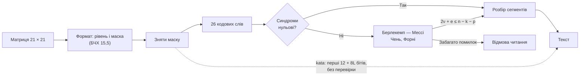

---

## 3. Розв’язок

Розв’язок проходить пари стовпців справа наліво, у кожній парі — спершу
правий модуль, потім лівий, а напрям руху змінюється після кожної пари.
Стовпець 6 пропускається: це вертикальна смуга синхронізації. Модуль
вважається службовим, якщо лежить у кутовій зоні біля шукового
візерунка (9 × 9 зліва вгорі, 9 × 8 справа вгорі, 8 × 9 зліва внизу —
візерунок, роздільник і поле формату) або на смузі синхронізації.

```csharp
public static string Scanner(int[][] qrcode)
{
    List<int> bits = ReadDataBits(qrcode);

    // 4 bits of mode (always 0100 = byte mode), then 8 bits of length.
    int length = ReadByte(bits, 4);
    var text = new StringBuilder(length);
    for (int i = 0; i < length; i++)
    {
        text.Append((char)ReadByte(bits, 12 + 8 * i));
    }
    return text.ToString();
}
```

Метод `ReadDataBits` збирає всі 208 бітів даних і знімає маску 0, а
`ReadByte` складає вісім бітів у число. Повний файл —
[`solution/CodeWars.cs`](solution/CodeWars.cs). Розв’язок читає стільки
бітів, скільки вимагає поле довжини, а не рівно 76. Тому за маски 0 він
так само читає й довші повідомлення рівнів L, M і Q — до 17 символів.

Для порівняння той самий алгоритм записано мовою Python
([`solution/codewars_solution.py`](solution/codewars_solution.py)):

```python
    bits = []
    upward = True
    for right in range(size - 1, 0, -2):
        if right <= 6:
            right -= 1                      # skip the vertical timing line
        rows = range(size - 1, -1, -1) if upward else range(size)
        for row in rows:
            for col in (right, right - 1):
                if not is_function(row, col):
                    bits.append(qrcode[row][col] ^ ((row + col) % 2 == 0))
        upward = not upward
```

| Ознака | C# | Python |
|---|---|---|
| Рядків у файлі розв’язку | 66 | 26 |
| Обхід | три вкладені цикли: пари, рядки, стовпці пари | ті самі цикли, `range` із від’ємним кроком |
| Зняття маски | `bit ^= 1` за умови | XOR із логічним значенням |
| Збирання байта | зсуви в циклі | `int("…", 2)` |
| Час на символ, локально | 1,2 мкс | 72,2 мкс |

Обидві версії мають складність `O(N²)` за часом для символу `N × N` і
`O(N²)` додаткової пам’яті на список бітів; для версії 1 це сталі
величини. Час на символ залежить від машини й наведений у розділі 7.6.

---

## 4. Структура репозиторію

```text
LR7-QRCode/
├── solution/
│   ├── CodeWars.cs                Розв’язок C#, надісланий на Codewars
│   └── codewars_solution.py       Той самий алгоритм на Python
├── csharp/QrScanner/              Самоперевірка C#: підключає solution/CodeWars.cs
├── src/qrv1/
│   ├── gf256.py                   Поле GF(2⁸), многочлени
│   ├── reed_solomon.py            Кодер і декодер помилок та стирань
│   ├── layout.py                  Службові зони, порядок читання, маски, формат, штрафи
│   ├── encoder.py                 Текст → символ (три режими, чотири рівні, вісім масок)
│   ├── decoder.py                 kata-декодер і повний декодер
│   ├── analysis.py                Точні ймовірності, моделі пошкоджень, підміна
│   ├── image.py                   Зображення, перевірка через OpenCV
│   └── cli.py                     Командний інтерфейс
├── tests/
│   ├── codewars_cases.json        9 пробних матриць: 4 C#, 4 Python, 1 з умови
│   ├── test_reed_solomon.py       Поле, кодер, декодер, звірка з reedsolo
│   ├── test_layout.py             Геометрія, формат, маски, штрафи
│   ├── test_codec.py              Кодер і декодери на матрицях Codewars
│   ├── test_solution.py           Python-розв’язок проти бібліотеки
│   ├── test_analysis.py           Формули проти повного перебору
│   ├── test_opencv.py             Взаємна звірка з OpenCV
│   ├── test_cross_implementation.py  C# проти Python
│   └── test_results.py            Збережені результати проти розрахунків
├── experiments/run_experiments.py Дев’ять рисунків і зведення
├── docs/
│   ├── figures/                   Рисунки та знімки Codewars (pdf/ — без заголовків)
│   └── results/                   experiments.json, summary.md, platform_results.json
├── .github/workflows/ci.yml       Python 3.10–3.12 і .NET 8
├── run.py                         Запуск без встановлення пакета
├── pyproject.toml
└── requirements.txt
```

Кодер, декодери та код Ріда — Соломона не мають зовнішніх залежностей.
`pytest` потрібен для тестів, `matplotlib` і `pillow` — для рисунків,
`opencv-python-headless` і `reedsolo` — лише для незалежних перевірок.
Звіт у форматах Word і PDF зберігається локально поза репозиторієм.

---

## 5. Швидкий старт

```bash
git clone https://github.com/RE22GDV/LR7-QRCode.git
cd LR7-QRCode
python run.py selftest
dotnet run --project csharp/QrScanner -- selftest
```

```text
[OK] csharp    QRShort                    -> 'Hi'       | повний декодер: корекція не вдалася
[OK] python    short qrcode               -> 'Hi'       | повний декодер: «Hi», рівень H, маска 0
...
пройдено все
```

```bash
python run.py encode "Warrior" --mask 0 > warrior.txt
python run.py scan warrior.txt
python run.py decode warrior.txt
python run.py capacity
```

`scan` виконує алгоритм kata, `decode` — повне декодування з корекцією;
`decode --erase 10,10 10,11` позначає модулі як стерті. Для Codewars
вставляється лише файл із каталогу `solution/`.

---

## 6. Верифікація

### 6.1 Codewars

Обидва розв’язки перевірено на платформі: спершу пробними тестами (TEST),
потім повним набором (ATTEMPT).

| Мова | Прогін | Пройдено | Помилок | Час платформи |
|---|---|---:|---:|---:|
| C# 12.0 | пробні тести | 4 | 0 | 2 889 мс |
| C# 12.0 | повний набір | 5 | 0 | 3 344 мс |
| Python 3.11 | пробні тести | 4 | 0 | 319 мс |
| Python 3.11 | повний набір | 204 | 0 | 482 мс |

NUnit у C# рахує тестові методи, а фреймворк Codewars для Python — окремі
перевірки. Повний набір Python містить чотири фіксовані тести та 200
випадкових кодів; у C# випадкові коди перевіряються одним методом. Час
платформи охоплює запуск тестового середовища (для C# — разом зі
збиранням проєкту), самі тести виконуються за 16,5 і 44,9 мс у C# та за
1,6 і 156,5 мс у Python. Підсумки збережено в
[`platform_results.json`](docs/results/platform_results.json).

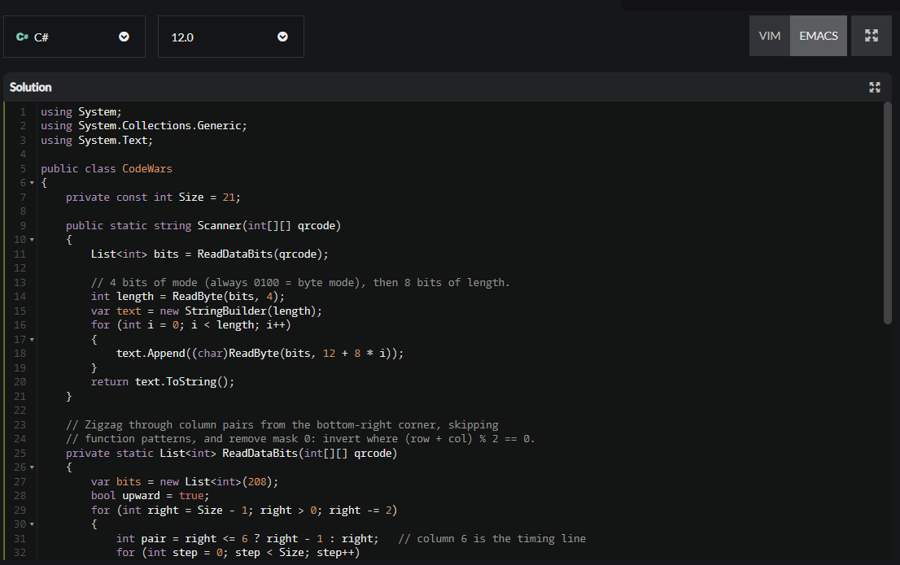

| C#: пробні тести | C#: повний набір |
|---|---|
| 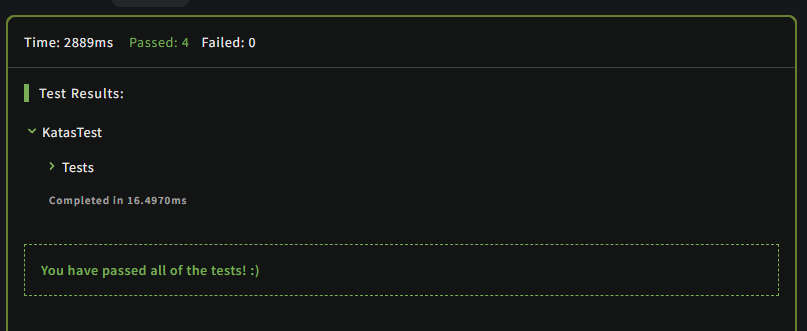 | 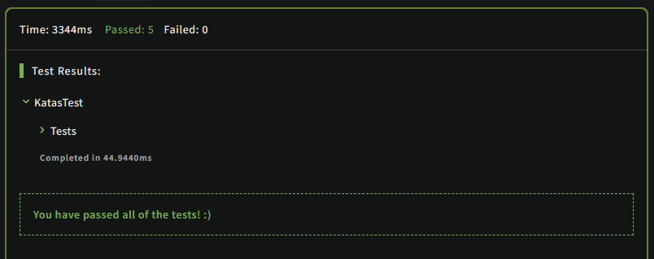 |

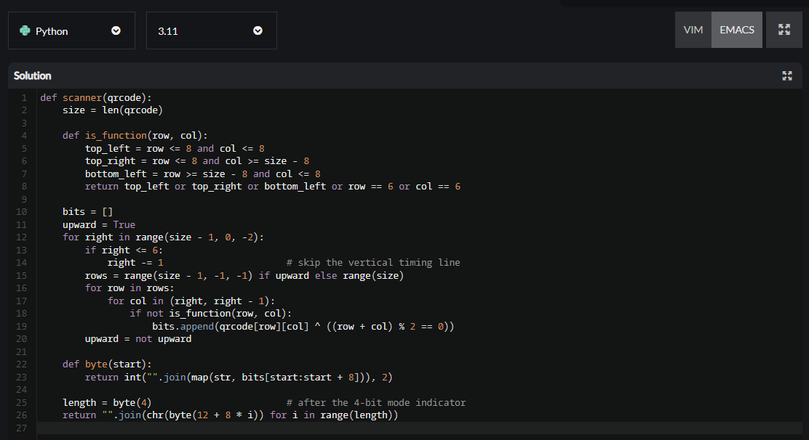

| Python: пробні тести | Python: повний набір |
|---|---|
| 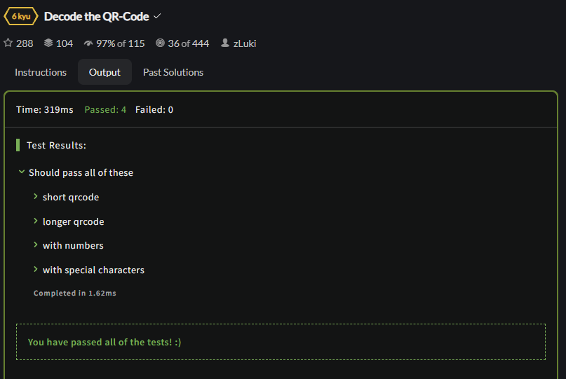 | 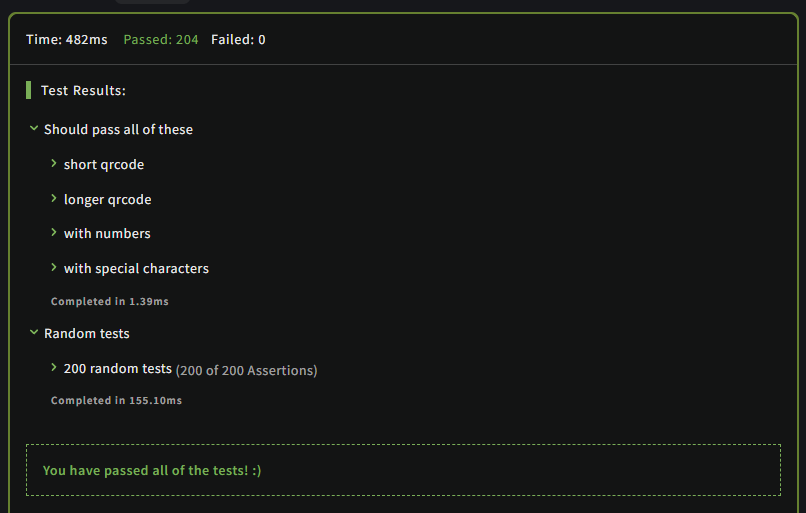 |

Код на знімках збігається з файлами каталогу `solution/`.

### 6.2 Пробні матриці: несподіваний результат

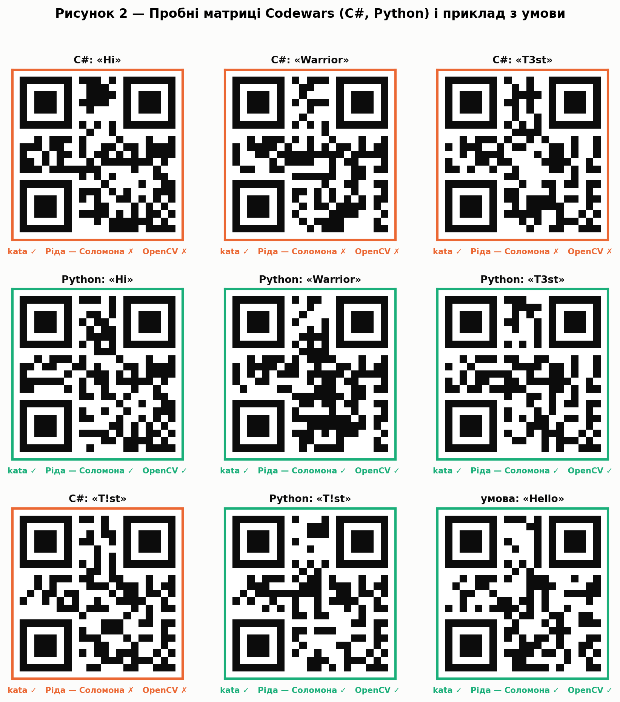

Пробні тести C#- і Python-версій kata містять **різні** матриці для тих
самих слів. Усі дев’ять матриць (разом із прикладом `Hello` з умови)
kata-декодер читає правильно. Проте лише п’ять із них — коректні
QR-коди: їх читає OpenCV, а наш кодер відтворює їх біт у біт.

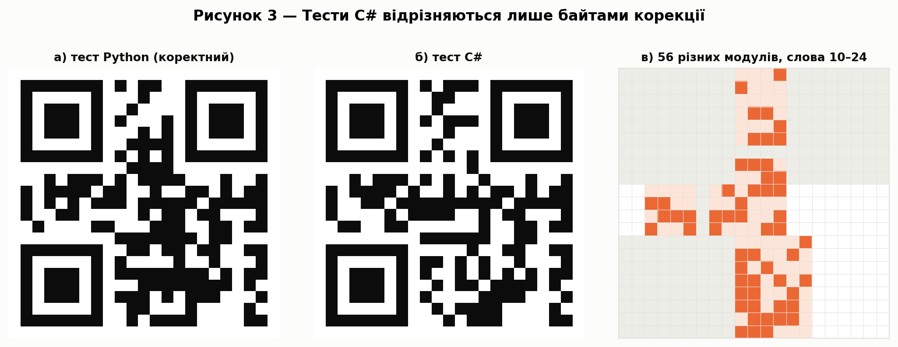

У чотирьох матрицях C# службова інформація й інформаційні слова
збігаються з Python-версією, але 15 із 17 перевірних слів (слова 10–24)
інші. Для слова `Warrior` це 56 модулів. П’ятнадцять хибних слів
перевищують `t = 8`, тому повний декодер повідомляє про невдачу,
бібліотека `reedsolo` теж, а OpenCV 4.13 код не читає. Kata-декодер цього
не помічає, бо читає лише перші 12 + 8L бітів. Поширені варіанти
параметрів коду (інші примітивні многочлени, початковий корінь 0–2,
твірний елемент 2 або 3) ці байти не відтворюють, тож походження
розбіжності встановити не вдалося.

### 6.3 Тести

```bash
python -m pytest -q
```

124 локальних тести перевіряють поле GF(2⁸), кодер і декодер
Ріда — Соломона (зокрема 300 випадкових слів проти `reedsolo`), геометрію
символу, обидва декодери на матрицях Codewars, точні формули проти
повного перебору та узгодженість збережених результатів. Розв’язок C#
перевіряє той самий файл, що надіслано на платформу: проєкт
`csharp/QrScanner` підключає `solution/CodeWars.cs` без копіювання. На
200 випадкових символах C# і Python повертають однакові рядки.

### 6.4 Незалежна звірка з OpenCV

| Напрям | Перевірено | Результат |
|---|---:|---|
| Наші символи → `QRCodeDetector` | 248 | 247 прочитано |
| Наші символи → `QRCodeDetectorAruco` | 248 | 248 прочитано |
| Символи кодера OpenCV → наш декодер | 62 | 62 прочитано |
| Символи кодера OpenCV = наш кодер | 62 | 60 біт у біт, 2 — інша маска |

Охоплено чотири рівні, вісім масок і три режими. Один символ (рівень M,
маска 6, `12345` у числовому режимі) класичний детектор OpenCV не знайшов
на зображенні, а детектор Aruco й наш декодер прочитали його правильно.
Два випадки різних масок (`T!st`, рівень H) пояснює правило N4 у
`qrcode_encoder.cpp` OpenCV: там обчислюється `min(|p − 45|, |p − 55|)`,
тож за рівно 50 % темних модулів маска отримує 10 штрафних балів, хоча за
стандартом відхилення до 5 % від 50 % не штрафується. З цим правилом
наш кодер обирає ту саму маску в усіх 62 випадках, а за однакової маски
символи збігаються повністю.

---

## 7. Обчислювальні експерименти

Зерно `20261004`, симуляції — 2 000 спроб на точку, плями — 1 000
положень. Точні ймовірності обчислено в раціональних числах, тож
симуляція слугує незалежною перевіркою формул. Повний прогін триває
близько хвилини.

### 7.1 Будова символу і 76 бітів kata

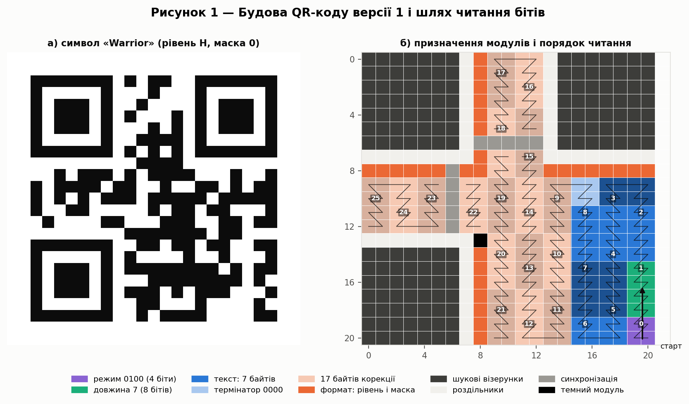

Шлях читання проходить 26 кодових слів. Для `Warrior` слово 0 містить
режим і половину довжини, слова 1–8 — решту довжини, текст і термінатор,
слова 9–25 — корекцію. Перші 76 бітів `Warrior` такі:

```text
0100 00000111 01010111 01100001 01110010 01110010 01101001 01101111 01110010 0000 1101
 M     L=7       W        a        r        r        i        o        r    term ECC…
```

Kata-декодер не перевіряє режим, тож на його відповідь впливають лише
`8 + 8 · 7 = 64` біти. Самоперевірка C# це підтверджує: інверсія будь-якого
з решти 377 модулів символу результату не змінює.

### 7.2 Випадкові пошкодження

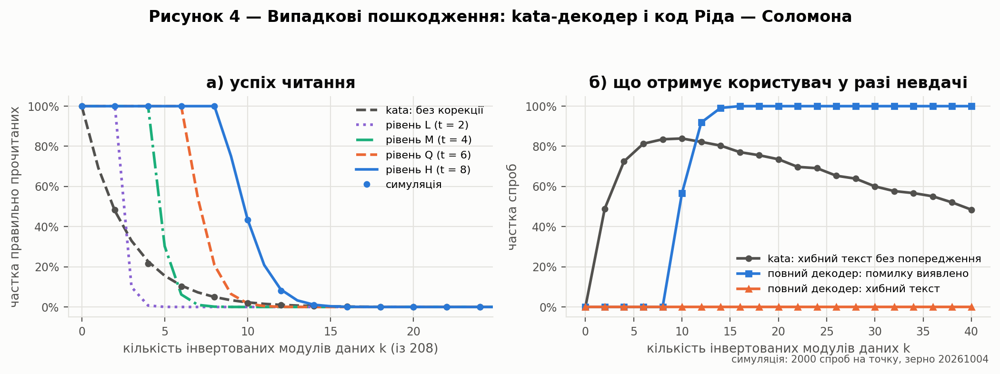

Інвертуються `k` різних випадкових модулів із 208. Kata-декодер дає
правильний текст лише тоді, коли жоден із `m = 8 + 8L` використаних бітів
не зачеплено ([формула (8)](#formula-8)):

<a id="formula-8"></a>

$$
P_{\text{kata}}(k) = \binom{208 - m}{k} \Big/ \binom{208}{k} \qquad\text{(8)}
$$

Повний декодер гарантовано виправляє символ, якщо пошкоджено не більше
`t` кодових слів. Кількість способів зачепити рівно `j` слів визначає
формула включень і виключень, звідки [формула (9)](#formula-9):

<a id="formula-9"></a>

$$
P_{\text{RS}}(k) = \sum_{j=0}^{t} \binom{26}{j} \sum_{i=0}^{j} (-1)^{i} \binom{j}{i} \binom{8(j-i)}{k} \Big/ \binom{208}{k} \qquad\text{(9)}
$$

| k | kata | L | M | Q | H |
|---:|---:|---:|---:|---:|---:|
| 1 | 69,2 % | 100 % | 100 % | 100 % | 100 % |
| 2 | 47,8 % | 100 % | 100 % | 100 % | 100 % |
| 4 | 22,7 % | 0,7 % | 100 % | 100 % | 100 % |
| 8 | 5,0 % | 0 % | 0,2 % | 20,9 % | 100 % |
| 10 | 2,3 % | 0 % | 0 % | 1,7 % | 43,6 % |
| 12 | 1,0 % | 0 % | 0 % | 0,1 % | 8,7 % |
| 16 | 0,2 % | 0 % | 0 % | 0 % | 0,1 % |

Обидві формули перевірено повним перебором для `k ≤ 3`, а симуляція
збігається з ними в межах статистичної похибки. Заявлені «до 30 %»
стосуються кодових слів: `8 / 26 ≈ 30,8 %`. Розкидані пошкодження
зачіпають різні слова, тому вже 10 випадкових інверсій (4,8 % модулів
даних) залишають рівню H лише 43,6 % успіху.

Важливішу відмінність видно на панелі б). Kata-декодер за невдачі майже
завжди повертає **хибний текст без попередження**: за `k = 8` таких
спроб 83,5 %. Повний декодер у всіх 42 000 спробах або читав правильно,
або повідомляв про відмову; хибного тексту не було жодного разу.

### 7.3 Плями, логотип і стирання

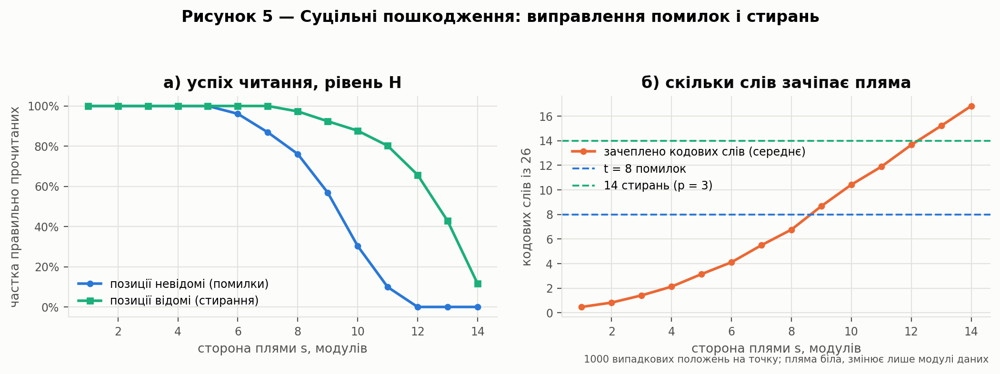

Біла квадратна пляма `s × s` у випадковому місці змінює модулі даних під
собою (вважається, що сканер символ усе ж знайшов). Модулі одного
слова розташовані поруч, тож пляма зачіпає небагато слів, і суцільні
пошкодження переносяться значно краще за розкидані.

| s | Помилки | Стирання | Зачеплено слів, середнє |
|---:|---:|---:|---:|
| 5 | 100 % | 100 % | 3,15 |
| 7 | 86,9 % | 100 % | 5,50 |
| 9 | 56,9 % | 92,4 % | 8,68 |
| 11 | 9,9 % | 80,2 % | 11,89 |
| 13 | 0 % | 42,8 % | 15,21 |

Якщо декодер знає, які модулі закриті, вони стають стираннями і
витрачають удвічі менше запасу ([нерівність (7)](#formula-7)). Понад 8
стирань резерв зростає до `p = 3`, тому межа — 14 зачеплених слів.

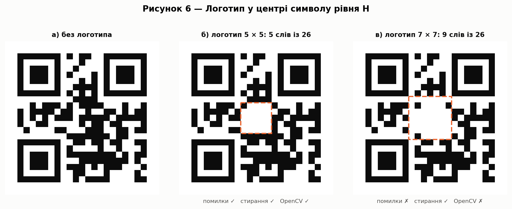

Логотип у центрі закриває модулі даних, а службові візерунки лишаються
видимими. Квадрат 5 × 5 зачіпає 5 слів, і символ читають усі три
декодери. Квадрат 7 × 7 зачіпає 9 слів — більше за `t = 8`: без знання
позицій код не читається ні нашим декодером, ні OpenCV, а зі стираннями
читається. Зі стираннями читаються й квадрати до 13 × 13 (12 слів);
15 × 15 зачіпає 22 слова й перевищує межу 14.

### 7.4 Маски

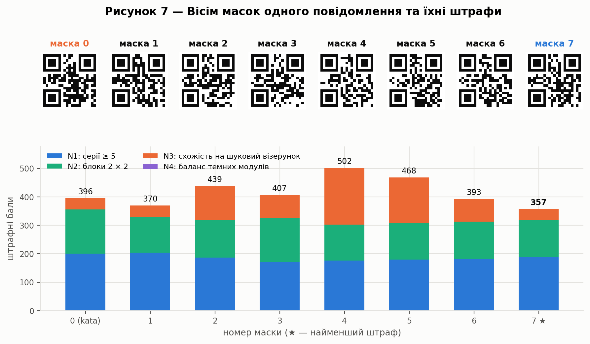

Для `Warrior` (рівень H) штрафи восьми масок — від 357 до 502 балів.
Маска 0, яку фіксує kata, має 396 балів; найменший штраф має маска 7, і
її ж обирає кодер OpenCV. Частка темних модулів для всіх масок лежить у
межах 48,1–54,0 %, тому штраф N4 нульовий. Сама маска не впливає на
корекцію: вона лише робить зображення зручнішим для сканера.

### 7.5 Помилкове декодування

Декодер, що виправляє до `t` слів, може «виправити» сильно пошкоджене
слово до чужого кодового. Частку рівномірно випадкових 26-байтових слів,
які лежать на відстані не більше `t` від якогось кодового слова, оцінює
[формула (10)](#formula-10):

<a id="formula-10"></a>

$$
P_{\text{хиб}} \approx \sum_{i=0}^{t} \binom{n}{i}\, 255^{\,i} \Big/ 256^{\,n-k} \qquad\text{(10)}
$$

Для рівня H це `3,2 · 10⁻¹⁶`. Ця оцінка стосується рівномірно випадкових
слів; у моделі з фіксованою кількістю інверсій хибних прочитань у
проведеній симуляції не зафіксовано. Для рівня L з `t = 2` оцінка дорівнює
`2,9 · 10⁻¹⁰`, а якби декодер витрачав і резерв `p` (`t = 3`) —
`6,0 · 10⁻⁷`, приблизно у дві тисячі разів більше. Саме тому стандарт залишає
перевірні слова `p` невикористаними.

### 7.6 Дві мови

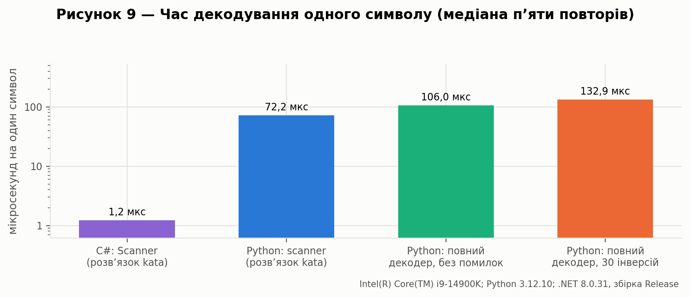

На процесорі Intel Core i9-14900K C#-розв’язок (збірка Release, .NET 8)
обробляє символ за 1,2 мкс, Python-розв’язок — за 72,2 мкс. Повний
декодер Python із корекцією займає 106,0 мкс без помилок і 132,9 мкс із
30 інверсіями. Це порівняння конкретних реалізацій на одній машині, а
не мов загалом.

---

## 8. QR-код і захист даних

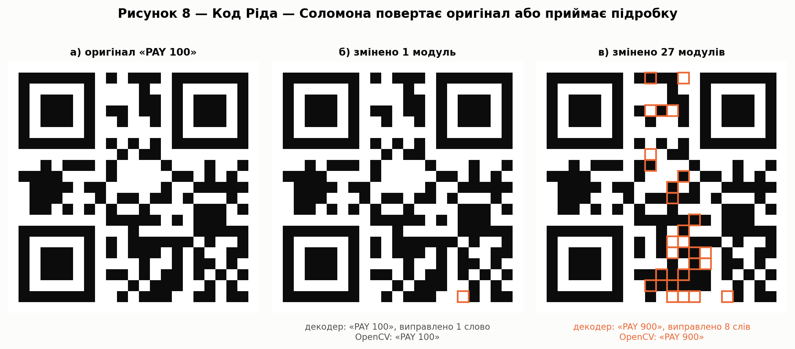

Код Ріда — Соломона не має ключа: кожен може обчислити перевірні слова
для будь-якого тексту. Тому він захищає від шуму, але не від підміни.

Символи `1` (`0x31`) і `9` (`0x39`) відрізняються одним бітом, тож в
інформаційних словах `PAY 100` перетворюється на `PAY 900` зміною одного
модуля. Перевірні слова при цьому лишаються від оригіналу, і декодер
«виправляє» цей модуль та повертає `PAY 100`: випадкова чи невміла зміна
відкочується без попередження.

Цілеспрямована підміна складніша. Кодові слова `PAY 100` і `PAY 900`
відрізняються в 18 позиціях — рівно на мінімальну відстань коду.
Достатньо переписати `d − t` із них ([формула (11)](#formula-11)):

<a id="formula-11"></a>

$$
r_{\min} = d\!\left(c, c'\right) - t = 18 - 8 = 10 \qquad\text{(11)}
$$

Після цього прийняте слово на відстані 8 від підробки й 10 від оригіналу.
Ми переписали 10 слів (27 модулів), і наш декодер, і OpenCV прочитали
`PAY 900`, «виправивши» 8 слів. Новий символ `PAY 900` відрізнявся б від
оригіналу в 64 модулях, тобто часткова підміна вдвічі дешевша. На
практиці зловмисник просто наклеює новий код поверх старого; маніпуляції
модулями як вектор атаки розглянуто, зокрема, у роботі Kieseberg та ін.
«QR Code Security» (2010).

Тому довіра до QR-коду визначається джерелом, а не корекцією помилок.
Для критичних даних, наприклад платіжних, потрібна криптографічна
автентифікація вмісту (цифровий підпис або код автентичності повідомлення),
а користувачу — перевірка
адреси перед переходом за посиланням.

---

## 9. Висновки

Розв’язано задачу Codewars «Decode the QR-Code» мовами C# і Python: обидві
версії проходять пробні й повні набори тестів платформи. Розв’язок проходить
символ зигзагом, пропускає службові зони, знімає маску 0 і розбирає
байтовий сегмент. Він читає стільки бітів, скільки задає поле довжини,
тому за маски 0 працює і для довших повідомлень рівнів L, M і Q.

Аналіз тестів показав, що матриці C#-версії kata не є коректними
QR-кодами: 15 із 17 перевірних слів не відповідають коду Ріда — Соломона,
і стандартний сканер OpenCV їх не читає. Kata-декодер цього не помічає,
бо використовує лише біти довжини й тексту. Умова також неточна щодо
місткості: рівень H у байтовому режимі вміщує сім символів, а не вісім.

Реалізовано повний декодер версії 1 з виправленням помилок і стирань та
кодер з автоматичним вибором маски. Їх незалежно звірено з бібліотекою
`reedsolo` і з OpenCV: символи збігаються біт у біт, а єдину розбіжність у
виборі маски пояснює відмінність правила штрафу N4 в OpenCV від стандарту.

Точні формули показали, що рівень H виправляє будь-які 8 інверсій
модулів даних, але 10 випадкових інверсій уже знижують успіх до 43,6 %,
бо пошкодження розкидаються по різних словах. Ця гарантія не поширюється
на довільні пошкодження службових зон. Суцільні плями переносяться краще,
а відомі позиції пошкоджень (стирання) майже подвоюють запас — до 14 слів
замість 8: логотип 7 × 7 читається лише зі стираннями. Kata-декодер за невдачі повертає хибний текст без
попередження, тоді як повний декодер у всіх 42 000 спробах симуляції або
читав правильно, або повідомляв про відмову.

Код Ріда — Соломона не має ключа і тому не захищає від підміни. Зміну
одного модуля декодер мовчки відкочує, але переписування 10 кодових слів
(27 модулів) змусило і наш декодер, і OpenCV прочитати `PAY 900` замість
`PAY 100`. Довіра до вмісту QR-коду має спиратися на джерело й
криптографічну автентифікацію, а не на корекцію помилок.

---

## 10. Відтворення результатів

```bash
python -m pip install -r requirements.txt
python -m pytest -q
python experiments/run_experiments.py
```

Програма записує всі величини в `docs/results/experiments.json`, оновлює
`summary.md` і рисунки. Ймовірності й результати симуляцій відтворюються
число в число завдяки фіксованому зерну; час виконання залежить від
машини. Рисунки з заголовками лежать у `docs/figures/`, без заголовків —
у `docs/figures/pdf/`.

```bash
# Час C#-розв'язку (потрібен .NET 8 SDK)
dotnet run -c Release --project csharp/QrScanner -- bench 200000
```

---

## 11. Список використаних джерел

1. Codewars. Decode the QR-Code [Електронний ресурс]. – Режим доступу: https://www.codewars.com/kata/5ef9c85dc41b4e000f9a645f

2. ISO/IEC 18004:2015. Information technology – Automatic identification and data capture techniques – QR Code bar code symbology specification. – Geneva : ISO, 2015.

3. Reed I. S., Solomon G. Polynomial Codes Over Certain Finite Fields // Journal of the Society for Industrial and Applied Mathematics. – 1960. – Vol. 8, No. 2. – P. 300–304.

4. Wikiversity. Reed–Solomon codes for coders [Електронний ресурс]. – Режим доступу: https://en.wikiversity.org/wiki/Reed%E2%80%93Solomon_codes_for_coders

5. Wikipedia. QR code [Електронний ресурс]. – Режим доступу: https://en.wikipedia.org/wiki/QR_code

6. OpenCV. qrcode_encoder.cpp, гілка 4.x [Електронний ресурс]. – Режим доступу: https://github.com/opencv/opencv/blob/4.x/modules/objdetect/src/qrcode_encoder.cpp

7. Kieseberg P., Leithner M., Mulazzani M. et al. QR Code Security // Proceedings of the 8th International Conference on Advances in Mobile Computing and Multimedia. – 2010. – P. 430–435.

8. Вихідний код та результати роботи [Електронний ресурс]. – Режим доступу: https://github.com/RE22GDV/LR7-QRCode

---

<p align="center"><sub>Лабораторна робота №7 · Захист даних · 2026</sub></p>
